# reto_03_POO_2024-1_JAMB
## The Restaurant
This Restaurant with no name, in its interior contains six classes:

### MenuItem
```python
class MenuItem:
    def __init__(self):
        pass
    def calculate_total_price(self):
        return 0
```
Nothing relevant, the default price is zero.

### Beverage
```python
class Beverage(MenuItem):
    def __init__(self, size):
        self.size = size
    def calculate_total_price(self):
        total = 0
        if self.size == "Small": total *= 0.75
        if self.size == "Regular": total *= 1
        if self.size == "Large": total *= 1.5
        return total 
```
As you can notice this MenuItem class is defined by three price modifiers, sorted by the size of the drink.

### Appetizer
```python
class Appetizer(MenuItem):
    def __init__(self, double):
        self.double = double

    def calculate_total_price(self):
        total = 0
        if self.double == "Simple": total *= 1
        if self.double == "Double": total *= 1.8
        return total
```
This MenuItem class has two price modificators, you can see that the double one, actually multiply by 1.8 the original price.

### Main Course
```python
class MainCourse(MenuItem):
    def __init__(self, addition):
        self.addition = addition

    def calculate_total_price(self):
        total = 0
        if self.addition == "No Extra": total *= 1
        if self.addition == "Extra": total *= 1.5
        return total     
```
In this case there is an modificator that multiply the base price by 1.5.

### THE ORDER CLASS
```python
class Order:
    def __init__(self):
        self.items = []

    def add_item(self, item=1):
        self.items.append((item))

    def calculate_total_bill(self):
        total_bill = 0
        for item in self.items:
            total_bill += item.calculate_total_price()
        return int(total_bill)
        
    def protocol(self):
        #...
        #code
        #...
        #more code
        #...
        #even more code
        #...
```
The heart of the whole program, the protocol() method has lines and lines of pure pleasure to work with.

## The Menu
The Menu is composed by 12 base items, i say base, because, the focus i gave to the challenge was the modificators, such as size, as you already saw (i hope so) in the MenuItem classes, and and as you will see below, where is more clear than THE ORDER CLASS:

### Beverage SubClasses
```python
class Water(Beverage):
    def __init__(self, size):
        super().__init__(size)

    def calculate_total_price(self):
        total = 1500
        if self.size == "Small": total *= 0
        if self.size == "Regular": total *= 0
        if self.size == "Large": total *= 1
        return total   
```
Base price $1500, but corresponds to the Large size, Small and Regular size are courtesy of the house.

```python
class Juice(Beverage):
    def __init__(self, size, fruit):
        super().__init__(size)
        self.fruit = fruit

    def calculate_total_price(self):
        total = 2000
        if self.size == "Small": total *= 0.75
        if self.size == "Regular": total *= 1
        if self.size == "Large": total *= 1.5
        if self.fruit == "Orange": total *= 1
        if self.fruit == "Blackberry": total *= 1.2
        if self.fruit == "Mango": total *= 1.4
        return total 
```
Base price $2000, first apply the size modificator, then a fruit multiplier

```python
class Soda(Beverage):
    def __init__(self, size, flavor):
        super().__init__(size)
        self.flavor = flavor

    def calculate_total_price(self):
        total = 3000
        if self.size == "Small": total *= 0.75
        if self.size == "Regular": total *= 1
        if self.size == "Large": total *= 1.5
        if self.flavor == "Coke": total += 100
        if self.flavor == "Lemon": total += 200
        if self.flavor == "Grapefruit": total += 500
        return total 
```
Base price $3000, first apply the size modificator, then a flavor extra, by executing the program you will notice that it will be refered as a brand.

```python
class Beer(Beverage):
    def __init__(self, size, brand):
        super().__init__(size)
        self.brand = brand
    
    def calculate_total_price(self):
        total = 4000
        if self.brand == "Corona": total += 500
        if self.brand == "Budweiser": total += 1000
        if self.brand == "Heineken": total += 1500
        if self.size == "Small": total *= 0.75
        if self.size == "Regular": total *= 1
        if self.size == "Large": total *= 1.5
        return total
```
First apply a brand modificator to the base price ($4000), and then the size modificator.

### Appetizer SubClasses
```python
class Soup(Appetizer):
    def __init__(self, double, type):
        super().__init__(double)
        self.type = type

    def calculate_total_price(self):
        total = 4000
        if self.type == "Corn": total += 0
        if self.type == "Tomato": total += 200
        if self.type == "Chicken": total += 500
        if self.double == "Simple": total *= 1
        if self.double == "Double": total *= 1.8
        return total
```
First an extra due to the main ingredient of the soup, then the Simple/Double modificator over the $4000 base price.

```python
class Egg(Appetizer):
    def __init__(self, double, preparation):
        super().__init__(double)
        self.preparation = preparation

    def calculate_total_price(self):
        total = 2000
        if self.preparation == "Boiled": total += 0
        if self.preparation == "Fried": total += 400
        if self.preparation == "Scrambled": total += 800
        if self.double == "Simple": total *= 1
        if self.double == "Double": total *= 1.8
        return total
```
First an extra due to the preparation of the egg, then the Simple/Double modificator over the $2000 base price.

```python
class Fruit(Appetizer):
    def __init__(self, double, kind):
        super().__init__(double)
        self.kind = kind

    def calculate_total_price(self):
        total = 3000
        if self.kind == "Banana": total += 0
        if self.kind == "Apple": total += 300
        if self.kind == "Strawberry": total += 700
        if self.double == "Simple": total *= 1
        if self.double == "Double": total *= 1.8
        return total
```
First an extra due to the cost of the fruit, then the Simple/Double modificator over the $3000 base price.

```python
class Salad(Appetizer):
    def __init__(self, double, aditive):
        super().__init__(double)
        self.aditive = aditive

    def calculate_total_price(self):
        total = 4000
        if self.double == "Simple": total *= 1
        if self.double == "Double": total *= 1.8
        if self.aditive == "No Aditive": total += 0
        if self.aditive == "Vinegar": total += 100
        if self.aditive == "Vinaigrette": total += 200
        if self.aditive == "Olive Oil": total += 300
        return total
```
First the Simple/Double modificator, and then and extra by the aditive that you want over the $4000 base price.

### Main Course SubClasses
```python
class Rice(MainCourse):
    def __init__(self, addition, color):
        super().__init__(addition)
        self.color = color

    def calculate_total_price(self):
        total = 8000
        if self.addition == "No Extra": total *= 1
        if self.addition == "Extra": total *= 1.5
        if self.color == "White": total += 0
        if self.color == "Yellow": total += 100
        if self.color == "Green": total += 400
        return total 
```
Base price of $8000, an optional extra portion modificator, and the color extra fee.

```python
class Meat(MainCourse):
    def __init__(self, addition, vegan):
        super().__init__(addition)
        self.vegan = vegan

    def calculate_total_price(self):
        total = 12000
        if self.vegan == "Meat": total += 0
        if self.vegan == "No Meat": total += 3000
        if self.addition == "No Extra": total *= 1
        if self.addition == "Extra": total *= 1.5
        return total   
```
Base price of $12000, it ask if you are vegan, then aplies the optional extra portion modificator.

```python
class Pasta(MainCourse):
    def __init__(self, addition, variety):
        super().__init__(addition)
        self.variety = variety

    def calculate_total_price(self):
        total = 10000
        if self.variety == "Spaghetti": total += 0
        if self.variety == "Shells": total += 700
        if self.variety == "Macaroni": total += 1500
        if self.addition == "No Extra": total *= 1
        if self.addition == "Extra": total *= 1.5
        return total  
```
Base price of $10000, each style of pasta has a different price, then aplies the optional extra portion fee.

```python
class Vegetables(MainCourse):
    def __init__(self, addition, making):
        super().__init__(addition)
        self.making = making

    def calculate_total_price(self):
        total = 8000
        if self.addition == "No Extra": total *= 1
        if self.addition == "Extra": total *= 1.5
        if self.making == "Boiled": total += 0
        if self.making == "Baked": total += 500
        if self.making == "Sauteed": total += 1000
        return total    
```
Base price of $8000, the optional extra portion modificator, then asks you how do you like your vegetables.

## The Execution (of the program)
```python
class Exercise(Order):
    def __init__(self, program, iterations):
        self.program = program
        self.iterations = iterations

    def execute(self):
        challenge = self.program
        counter = self.iterations
        while counter > 0:
            challenge.protocol()
            counter -=1
        return challenge.calculate_total_bill()
```
I created the class Exercise as a SubClass of order, it permits that more than only one person can order and returns the bill, given the circumstances we can call it the Bill Class 

```python
if __name__ == "__main__": 
    counter = int(input("Welcome to this establishment\nHow many people?\n"))
    order = Order()
    challenge_03 = Exercise(order, counter)
    print(f"\nThe total bill is:     ${challenge_03.execute()} \nThanks for coming!")
```
This bad boy above initialize the program. The End

### Appendix I
The class diagram (non) representative of the program, i am so bad at this.

```mermaid
classDiagram
    MenuItem <|-- MainCourse
    MenuItem <|-- Appetizer
    MenuItem <|-- Beverage
    MenuItem: +calculate_total_price(self)

    MainCourse <|-- Rice
    MainCourse <|-- Meat
    MainCourse <|-- Pasta
    MainCourse <|-- Vegetables
    MainCourse : + str addition("No Extra", "Extra") 
    

    class Rice{
    +string color("White", "Yellow", "Green")
    }
    class Meat{
    +string color("Meat", "No Meat")
    }
    class Pasta{
    +string variety("Spaguetti", "Shells", "Macaroni")
    }
    class Vegetables{
    +string preparation("Boiled", "Baked", "Sauteed")
    }


    Appetizer <|-- Soup
    Appetizer <|-- Egg
    Appetizer <|-- Fruit
    Appetizer <|-- Salad
    Appetizer : +str double("Simple", "Double")

    class Soup{
    +string type("Corn", "Tomato", "Chicken")

    }
    class Egg{
    +string preparation("Boiled", "Fried", "Scrambled")
 
    }
    class Fruit{
    +string type("Banana", "Apple", "Strawberry")

    }
    class Salad{
    +string aditive("No Aditive", "Vinegar", "Vinaigrette", "Olive Oil")
    }


    Beverage <|-- Water
    Beverage <|-- Juice
    Beverage <|-- Soda
    Beverage <|-- Beer
    Beverage : +string size("Small", "Regular", "Large")



    class Water{

    }
    class Juice{
    +string flavor("Orange", "Blackberry", "Mango")
    

    }
    class Soda{
    +string flavor("Coke", "Lemon", "Grapefruit")
    
    }
    class Beer{
    +string brand("Corona", "Budweiser", "Heineken")

    }
```


### Appendix II
The rectangle class seen in class.
```python
class Line:
    def __init__(self, start: Point=0, end: Point=0):
        self.start = start
        self.end = end

    def compute_length(self):
        x_cathetus = self.end.x - self.start.x
        y_cathetus = self.end.y - self.start.y
        hypotenuse = ((x_cathetus ** 2) + (y_cathetus ** 2)) ** 0.5
        return hypotenuse

    def compute_slope(self):
        x_cathetus = self.end.x - self.start.x
        y_cathetus = self.end.y - self.start.y
        hypotenuse = self.compute_length()
        rad = asin(y_cathetus / hypotenuse)
        slope = degrees(rad)
        return abs(slope)

    def compute_horizontal_cross(self):
        if self.start.y > 0 and self.end.y > 0:
            return False
        if self.start.y < 0 and self.end.y < 0:
            return False
        else: return True

    def compute_vertical_cross(self):
        if self.start.x > 0 and self.end.x > 0:
            return False
        if self.start.x < 0 and self.end.x < 0:
            return False
        else: return True        
```
